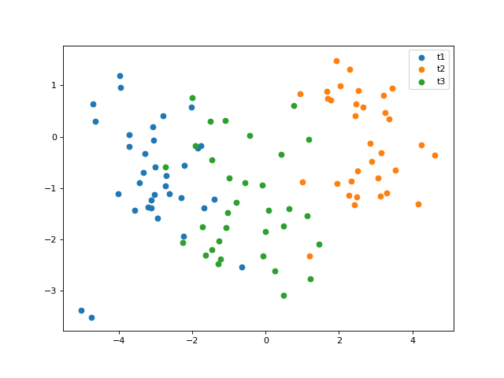
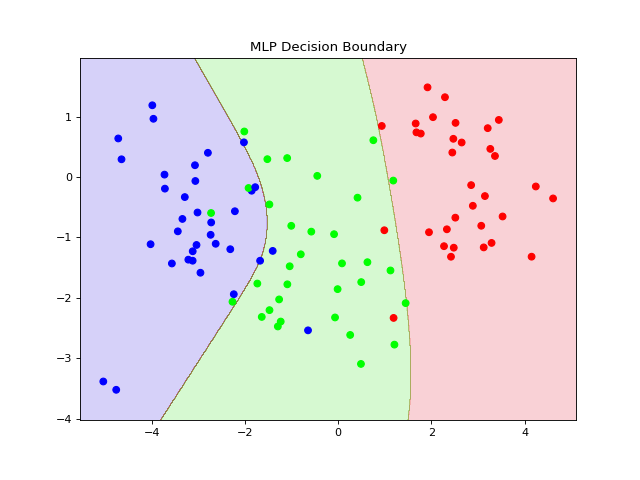
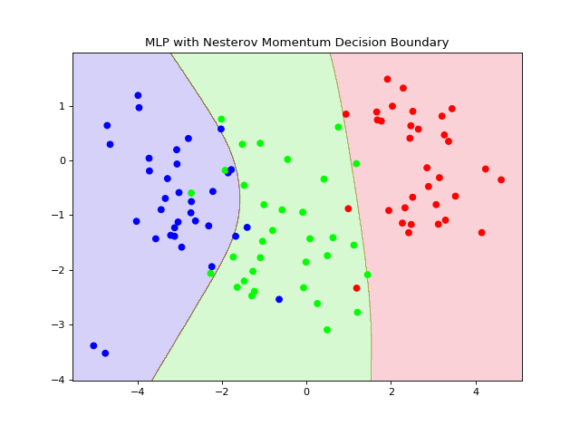
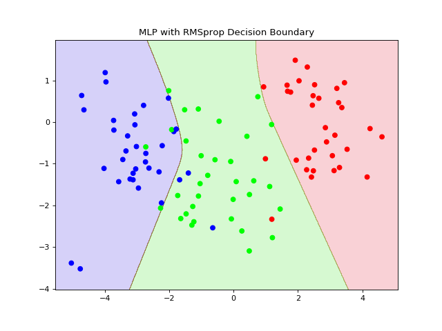
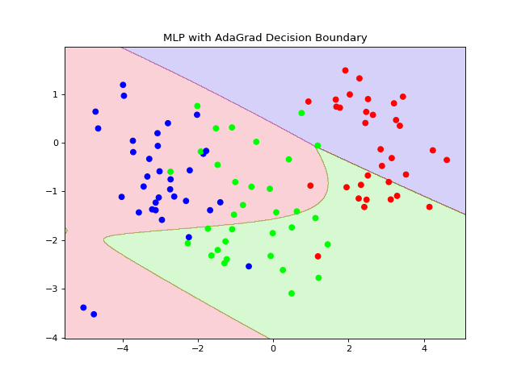
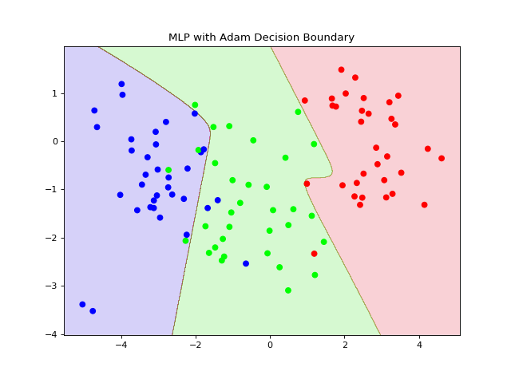

# Deep-Learning-from-scratch
Multilayer Perceptron algorithms written using only **numpy**, **pandas**, and **matplotlib**. Every neural Network has the same 3 layer structure: input, hidden layer, output. Only the way that the weights get updated changes. All the algorithms run for 15000 epochs and have a strating learing rate of 0.001. 

## Data
For each algorithm we use the same set of randomly generated 3 clusters (shown below). We can see that the clusters are not esily seperable. 

  

## Algorithms

### Multilayer Perceptron
The simplest version of an Artificail Neural Netowrk.

  

### Multilayer Perceptron with Nesterov momentum

  

### Multilayer Perceptron with RMSprop

  

### Multilayer Perceptron with AdaGrad

  

### Multilayer Perceptron with Adam Optimizer

  

## Results

We can see that the different optimization scheme produce different decision boundaries with varying degrees of accuracy. The best results seems to come from first three algoritms. AdaGrad has by far the worse results (but does improve with additional training). Adam Optimizer seems to overfit a little but performs much better than AdaGrad.